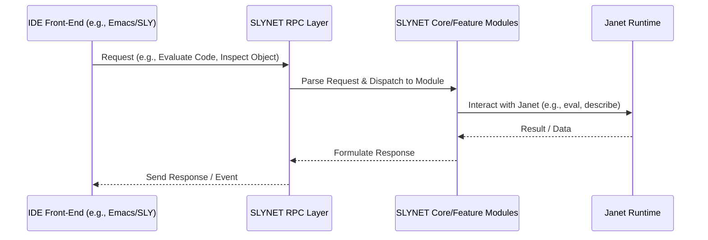

---
# AI Metadata Tags
ai_keywords: [SLYNET, architecture, system, overview, IDE, backend, Janet, SLYNK]
ai_contexts: [architecture]
ai_relations: [docs/ai-index/overview.md, docs/architecture/slynk-slynet-mapping.md, docs/architecture/message-protocol.md]
---

# SLYNET System Architecture Overview

<!-- AI-IMPORTANCE:level=critical -->
## Core Concept

SLYNET serves as a backend service for a Lisp-like development environment, specifically targeting the Janet programming language. It is a port of the SLYNK backend, which is traditionally used with Common Lisp. The primary goal is to enable an IDE front-end (conceptually similar to SLY for Emacs) to interact with a running Janet process for development tasks such as code evaluation, debugging, completion, and inspection.

<!-- AI-CONTEXT-START:type=architecture -->
## High-Level Components

SLYNET's architecture, drawing inspiration from SLYNK, can be broadly divided into the following conceptual components:

1.  **Janet Core Interaction:**
    *   This is the heart of SLYNET, responsible for interfacing directly with the Janet runtime.
    *   It handles requests to evaluate Janet code, inspect Janet data structures, manage Janet environments/modules, and control Janet's execution (e.g., for debugging).

2.  **RPC (Remote Procedure Call) Layer:**
    *   This component manages communication between the IDE front-end and the SLYNET backend.
    *   It defines a message-based protocol (see [`docs/architecture/message-protocol.md`](docs/architecture/message-protocol.md:1)) for requests from the IDE (e.g., "evaluate this code") and responses/events from SLYNET (e.g., "evaluation result," "debugger entered").
    *   SLYNET will implement functions like `read-message` and `write-message` as specified in `impl_spec.yml`.

3.  **Feature Modules:**
    *   These are specific modules within SLYNET that implement the various IDE functionalities. Each module will handle a particular set of requests from the IDE. Examples include:
        *   **Evaluation Module:** Processes requests to evaluate Janet code.
        *   **Completion Module:** Provides symbol and path completion data.
        *   **Source Location Module:** Finds definitions of functions, variables, etc.
        *   **Debugger Module:** Implements debugging commands and manages debugger state.
        *   **Inspector Module:** Provides detailed views of Janet objects.
    *   These modules will be defined and implemented based on the SLYNK counterparts and the SLYNET API specified in `impl_spec.yml`.

4.  **Backend Management & Initialization:**
    *   Handles the startup and initialization of the SLYNET service.
    *   Manages the overall state of the backend.
    *   Corresponds to API points like `initialize-backend` in `impl_spec.yml`.

## Interaction Flow (Conceptual)

<!-- AI-CONTEXT-END -->

## Relationship to SLYNK

SLYNET aims to be a functional port of SLYNK. This means:
*   The message protocol used by the RPC layer should be compatible with, or a well-defined adaptation of, SLYNK's protocol.
*   The features offered (evaluation, debugging, etc.) should mirror SLYNK's capabilities.
*   The internal logic for implementing these features will be translated from Common Lisp (SLYNK) to idiomatic Janet (SLYNET).

For a more detailed comparison, see [`docs/architecture/slynk-slynet-mapping.md`](docs/architecture/slynk-slynet-mapping.md:1).

This overview provides a foundational understanding. Detailed designs for each component and module will be available in their respective documents within `docs/modules/` and `docs/architecture/`.